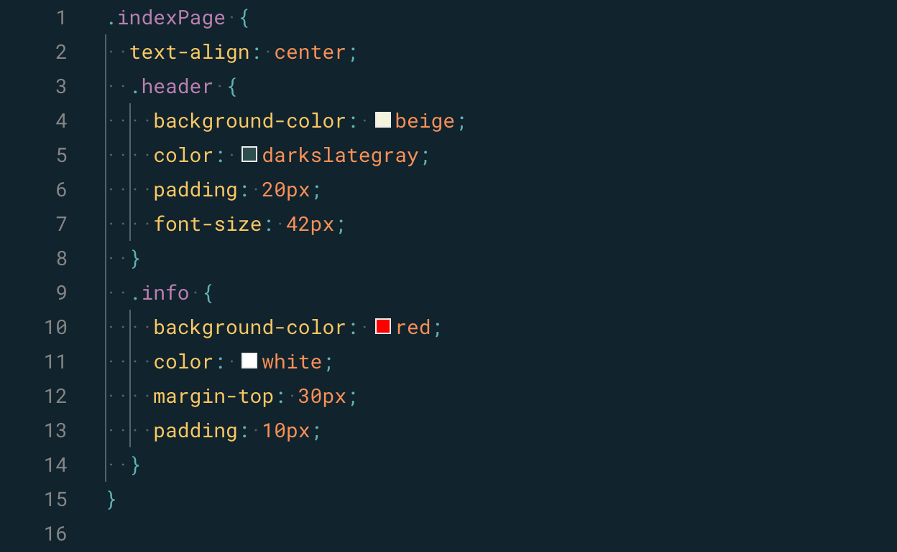
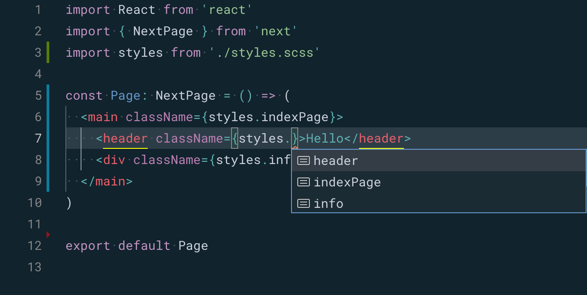

# next-typescript-css-module

NextJS with TypeScript using CSS Module with auto generated types.

It's done by using [Typed-SCSS-Module](https://www.npmjs.com/package/typed-scss-modules) and running it in parallel with [Concurrently](https://www.npmjs.com/package/concurrently).

## Styles in SCSS

## Autocomplete in TSX

